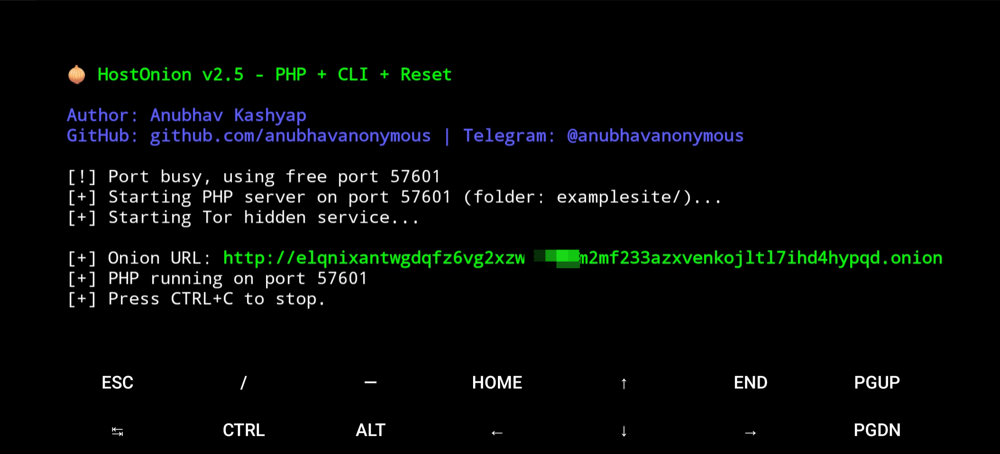

<div align="center">


# 🧅 HostOnion

**Host a Hidden Service on Tor with a `.onion` Address — from your terminal.**

<p align="center">


<br>


<br>


<br>


</p>

</div>

---

## 🚀 About

HostOnion turns your device into a temporary **Deep Web server** by hosting your PHP/HTML site as a Tor Hidden Service — complete with a unique `.onion` address — in seconds.

It automatically:
- Starts a local **PHP server**
- Configures **Tor hidden service**
- Generates a unique **`.onion` URL**
- Routes all traffic securely through the **Tor network**

Once stopped, the hidden service goes offline. No lingering exposure.

---

## 🆕 What's New in v2.5

| Feature | Details |
|--------|---------|
| 🐍 Full Python 3 rewrite | Cleaner, more stable codebase |
| 📁 Custom site folder | Point to any local site folder |
| 🌐 Full PHP support | Not just static HTML |
| 🔌 Custom port | `--port` flag for manual port selection |
| 🔍 Auto port detection | Finds a free port if none is specified |
| 🔁 Onion reset | `--new` flag to regenerate your `.onion` address |
| 📱 Termux + Linux | Works on both Android Termux and POSIX Linux |

---

## 📦 Requirements

- Python 3
- PHP
- Tor

### Install on Termux

```bash
pkg install python php tor
```

### Install on Linux (Debian/Ubuntu)

```bash
sudo apt install python3 php tor
```

---

## ⚙️ Installation

```bash
git clone https://github.com/anubhavanonymous/HostOnion
cd HostOnion
```

---

## 🖥️ Usage

### Basic Usage

```bash
python3 hostonion.py your_site_folder
```

### Try the Example Site

```bash
python3 hostonion.py examplesite
```

### Custom Port

```bash
python3 hostonion.py your_site_folder --port 8080
```

### Generate a New `.onion` Address

```bash
python3 hostonion.py your_site_folder --new
```

> Press `CTRL+C` to stop the service.

---

## 📟 Example Output

```
🧅 HostOnion v2.5 - PHP + CLI + Reset

Author: Anubhav Kashyap
GitHub: github.com/anubhavanonymous | Telegram: @anubhavanonymous

[+] Starting PHP server on port 9000 (folder: examplesite)...
[+] Starting Tor hidden service...

[+] Onion URL: http://xxxxxxxxxxxxxxxx.onion
[+] PHP running on port 9000
[+] Press CTRL+C to stop.
```

---

## 🖼️ Screenshot



---

## 🧠 How It Works

```
Your Site Folder
      │
      ▼
PHP Built-in Server (localhost:PORT)
      │
      ▼
Tor Hidden Service (torrc config)
      │
      ▼
Unique .onion Address ← Users on Tor Browser access here
```

1. Starts PHP built-in server on `localhost`
2. Writes a Tor `torrc` config pointing to that port
3. Generates a hidden service directory
4. Launches Tor
5. Waits for the `.onion` address to be assigned
6. Displays your unique `.onion` URL

---

## 📌 Notes

- Originally built for **Termux** users — works on low-end Android devices
- Now also supports **Linux** and other POSIX systems
- The service is **temporary** — it goes offline when the script stops
- Each run reuses the same `.onion` address unless `--new` is passed

---

## ⚠️ Disclaimer

This tool is for **educational purposes only**. The author is not responsible for any misuse. Always comply with your local laws and Tor's terms of use.

---

## 👨‍💻 Author

**Anubhav Kashyap**

[](https://github.com/anubhavanonymous)
[](https://t.me/anubhavanonymous)

---

<div align="center">

⭐ Star this repo if you found it useful!

</div>
